# 🎨 Profile-Gotchi Gallery

Here is the full roster of pixel art mascots available in **Profile-Gotchi**.
Now featuring **23 unique pets**, **5 Legendary creatures**, **3 themes**, **6 moods**, **Leveling System**, and **Seasonal Events**!

## 🎭 Themes & Moods Demo

| Minimal | Cyberpunk 🌆 | Nature 🌿 |
| :---: | :---: | :---: |
|  | 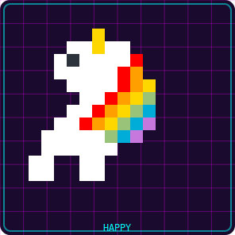 | 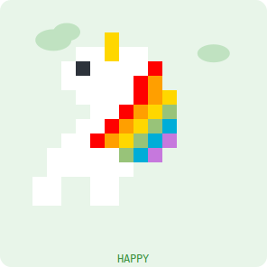 |

| Happy ⚡ | Hyper 🔥 | Night Owl 🦉 | Weekend 🏖️ | Sleeping 💤 | Ghost 👻 |
| :---: | :---: | :---: | :---: | :---: | :---: |
| 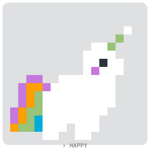 | 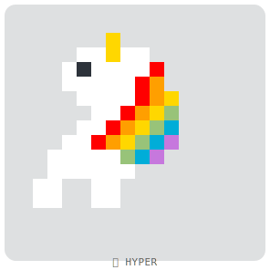 | 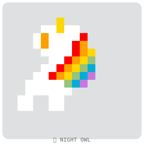 | 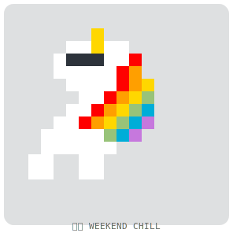 | 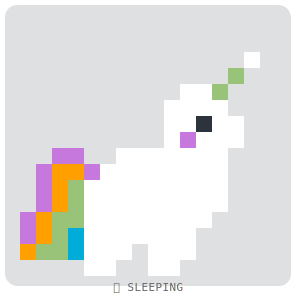 |  |

---

## 🎄 Seasonal Events (Auto-Detect!)

Your pet automatically wears holiday accessories based on the current date!

| 🎅 Christmas | 🎉 New Year | 💕 Valentine | 🎃 Halloween |
| :---: | :---: | :---: | :---: |
| 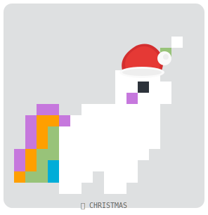 | 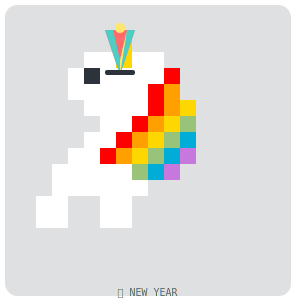 |  | 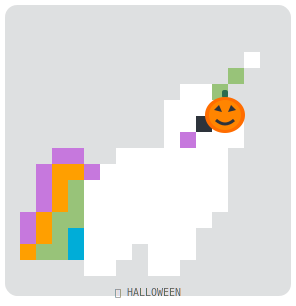 |

| 🧧 Tết | ☕ Programmer Day | 🌹 Women's Day | 🎩 Men's Day |
| :---: | :---: | :---: | :---: |
| 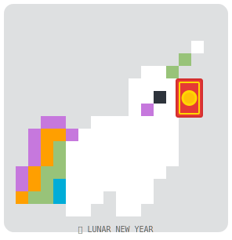 | 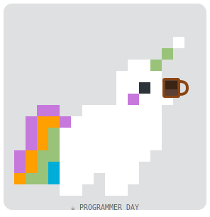 | 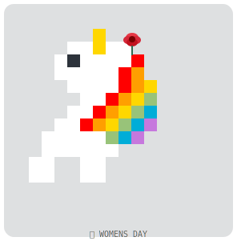 | 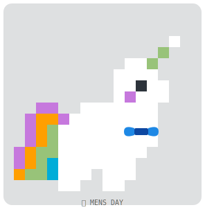 |

### 🥚 Easter Eggs & Special Events

| 👻 Friday 13th | 🤡 April Fools |
| :---: | :---: |
| 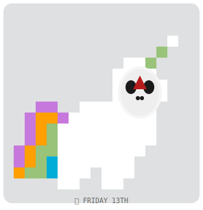 | 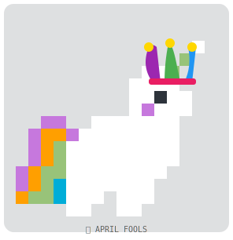 |

> **Priority Logic:** If a Major Holiday overlaps with a Special Event, the **Major Holiday** takes precedence.
> **Zero Config!** Accessories appear automatically - no setup needed!

---

## 🏆 Legendary Pets

Unlock special creatures by achieving milestones! **Harder achievements take priority.**

| 🦖 Mecha-Rex | 🐉 Hydra | 🗿 Cyber Golem | 👻 Void Spirit | 🦄 Unicorn |
| :---: | :---: | :---: | :---: | :---: |
| 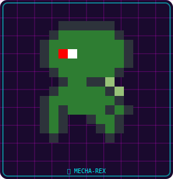 | 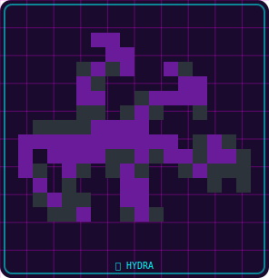 | 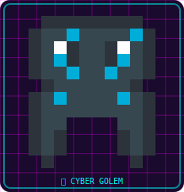 | 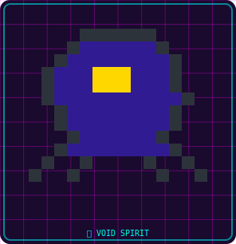 | 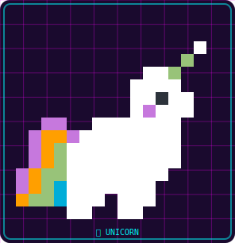 |
| **1000+ commits** | **5+ languages** | **50+ closed issues** | **Night coder (00-04h)** | **⭐ Star/Fork repo** |

### Unlock Requirements (Priority Order)

| Priority | Legendary | Trigger | Difficulty |
|:---:|:---|:---|:---:|
| 1 | 🦖 **Mecha-Rex** | `totalCommits > 1000` | 🔥 Hardest |
| 2 | 🐉 **Hydra** | `languageCount >= 5` | 💪 Hard |
| 3 | 🗿 **Cyber Golem** | `closedIssues > 50` | 🛠️ Medium |
| 4 | 👻 **Void Spirit** | Commit 00:00-04:00 | 🌙 Conditional |
| 5 | 🦄 **Unicorn** | ⭐ Star or 🍴 Fork this repo | ✨ Entry Level |

> **Note:** Unicorn is the easiest legendary - just star or fork this repository!

---

## 🦁 The Roster

| Pet | Preview |
| :--- | :---: |
| **Crab** (Rust) | 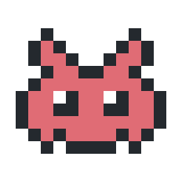 |
| **Elephant** (PHP) | 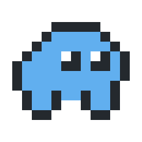 |
| **Coffee** (Java) | 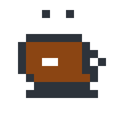 |
| **Bird** (Swift) | 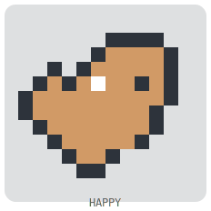 |
| **Robot** (C++/C#) | 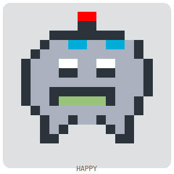 |
| **Whale** (Docker) | 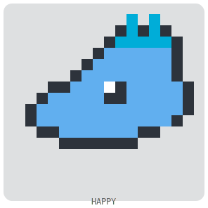 |
| **Gem** (Ruby) | 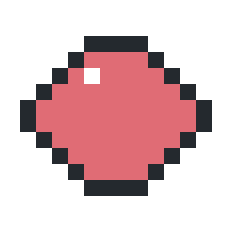 |
| **Chameleon** (HTML) | 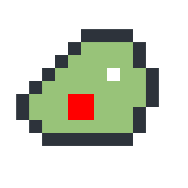 |
| **Spider** (JS/TS) | 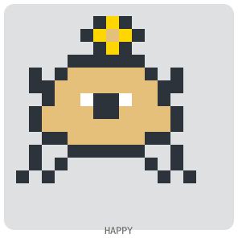 |
| **Snake** (Python) | 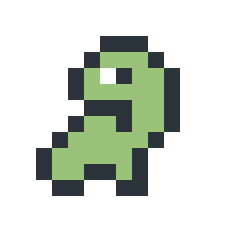 |
| **Gopher** (Go) | 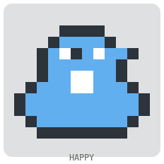 |
| **Cat** (Default) | 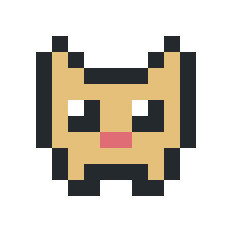 |
| **Tux** (Shell) |  |
| **Fox** (Kotlin) | 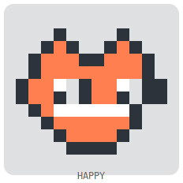 |
| **Hummingbird** (Dart) | 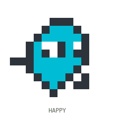 |
| **Gear** (C) | 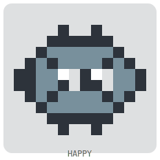 |
| **Ladder** (Scala) | 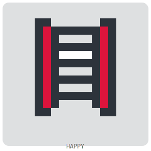 |
| **Owl** (R) | 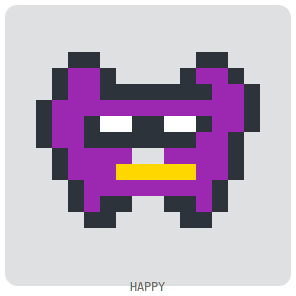 |
| **Camel** (Perl) | 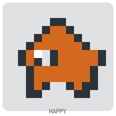 |
| **Capybara** (Lua) | 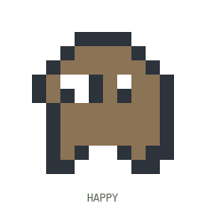 |
| **Alpaca** (Julia) | 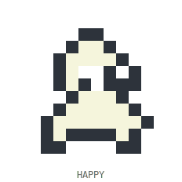 |
| **Phoenix** (Elixir) | 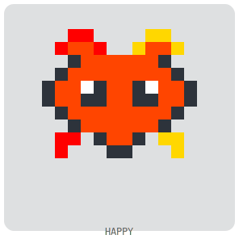 |
