# 🎨 Profile-Gotchi Gallery

Here is the full roster of pixel art mascots available in **Profile-Gotchi v2.0.0**.
Now featuring **23 unique pets**, **3 themes**, **6 moods**, **Leveling System**, and a **Legendary Unicorn** (unlock by ⭐ Star or 🍴 Fork)!

## 🎭 Theme Demos

| Theme | Preview |
| :--- | :---: |
| **Minimal** (default) |  |
| **Cyberpunk** 🌆 |  |
| **Nature** 🌿 |  |

---

## 🦁 The Roster

| Pet | Happy ⚡ | Sleeping 💤 | Ghost 👻 |
| :--- | :---: | :---: | :---: |
| **Crab** (Rust) | 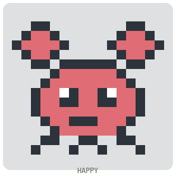 |  | 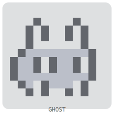 |
| **Elephant** (PHP) | 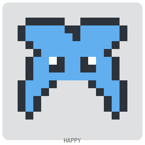 | 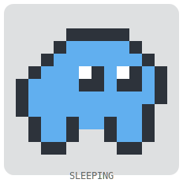 | 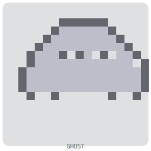 |
| **Coffee** (Java) | 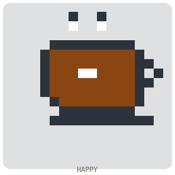 |  | 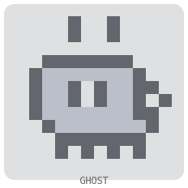 |
| **Bird** (Swift) | 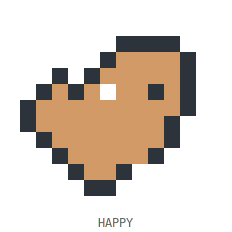 | 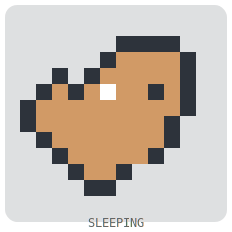 | 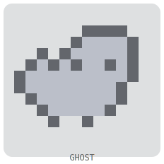 |
| **Robot** (C++/C#) | 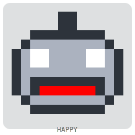 | 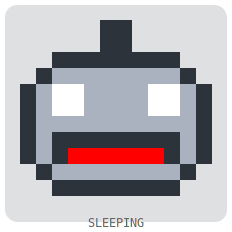 | 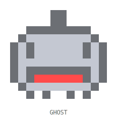 |
| **Whale** (Docker) | 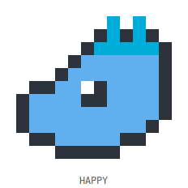 | 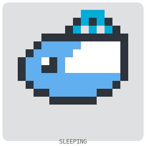 | 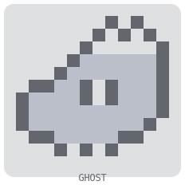 |
| **Gem** (Ruby) | 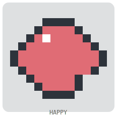 | 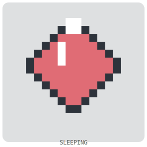 | 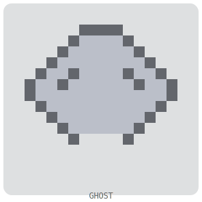 |
| **Chameleon** (HTML) | 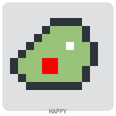 | 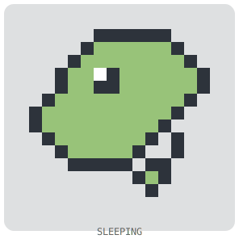 | 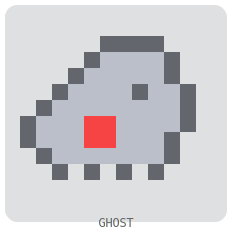 |
| **Spider** (JS/TS) | 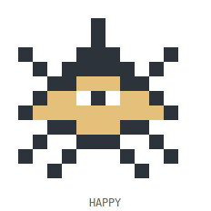 | 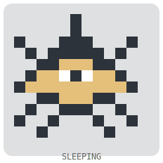 | 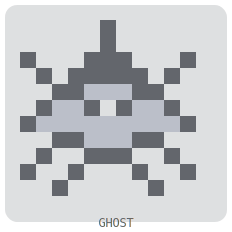 |
| **Snake** (Python) | 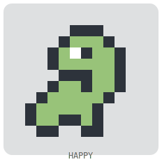 |  | 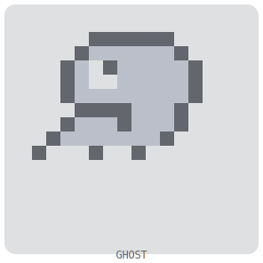 |
| **Gopher** (Go) | 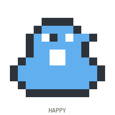 | 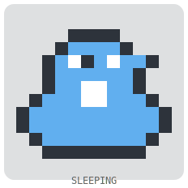 | 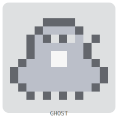 |
| **Cat** (Default) | 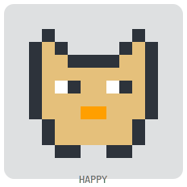 | 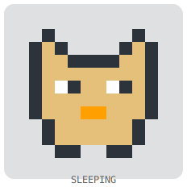 | 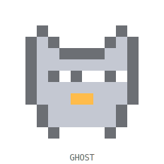 |
| **Tux** (Shell) | 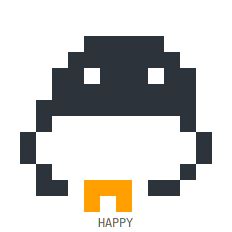 | 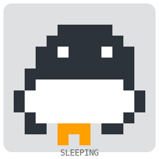 | 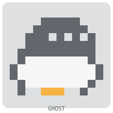 |
| **Fox** (Kotlin) | 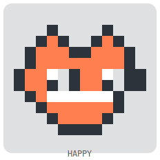 | 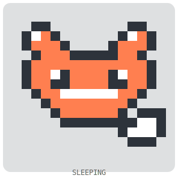 |  |
| **Hummingbird** (Dart) | 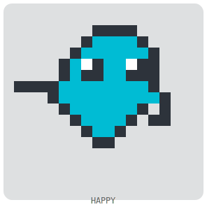 | 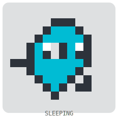 | 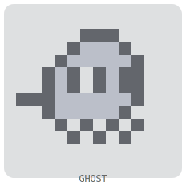 |
| **Gear** (C) | 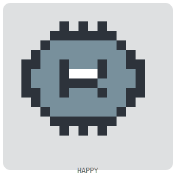 | 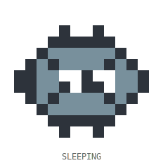 | 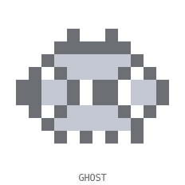 |
| **Ladder** (Scala) |  | 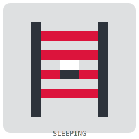 | 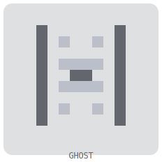 |
| **Owl** (R) | 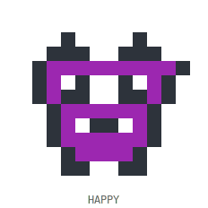 | 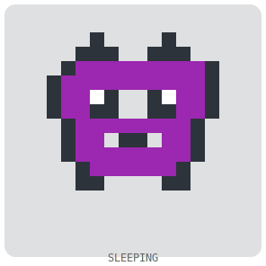 | 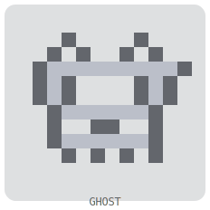 |
| **Camel** (Perl) | 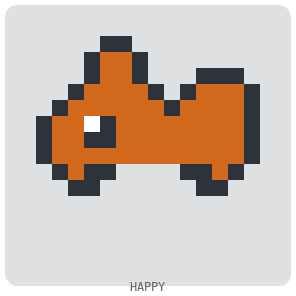 |  |  |
| **Capybara** (Lua) |  |  |  |
| **Alpaca** (Julia) |  |  |  |
| **Phoenix** (Elixir) |  |  |  |
| **Unicorn** (Legendary) |  |  |  |

