# 🎨 Profile-Gotchi Gallery

Here is the full roster of pixel art mascots available in **Profile-Gotchi**.
Now featuring **23 unique pets**, **5 Legendary creatures**, **5 Mythical beings**, **6 themes**, **7 moods**, **Evolution System**, **Weather Effects**, **Achievement Badges**, and **20+ Seasonal Events** (including international holidays)!

## 🎭 Themes & Moods Demo

| Minimal | Cyberpunk 🌆 | Nature 🌿 | Synthwave 🌅 | Matrix 💻 | Ocean 🌊 |
| :---: | :---: | :---: | :---: | :---: | :---: |
|  |  |  | 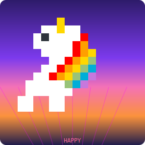 | 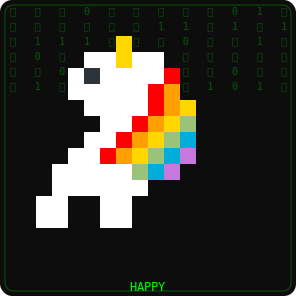 | 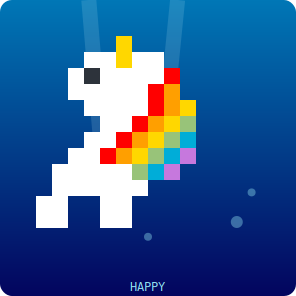 |

| Happy ⚡ | Hyper 🔥 | Night Owl 🦉 | Weekend 🏖️ | Sleeping 💤 | Ghost 👻 |
| :---: | :---: | :---: | :---: | :---: | :---: |
|  |  |  |  |  |  |

---

## 🌧️ Weather Effects

Dynamic weather based on mood, time, and season!

| 🌧️ Rain | ❄️ Snow | ✨ Stars | 🌟 Fireflies | 🍂 Leaves |
| :---: | :---: | :---: | :---: | :---: |
| 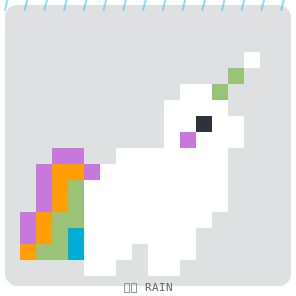 |  |  | 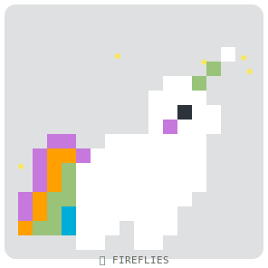 |  |

---

## 🦋 Evolution System

Your pet grows as you level up! Each evolution stage brings unique visual effects.

| 🥚 Egg (Lv.1-5) | 🐣 Baby (Lv.6-15) | 🌱 Juvenile (Lv.16-30) | ⭐ Adult (Lv.31-50) |
| :---: | :---: | :---: | :---: |
| 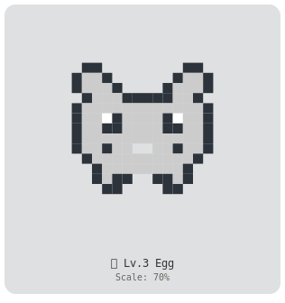 | 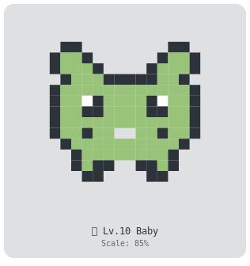 |  |  |

| 💫 Master (Lv.51-75) | 👑 Legendary (Lv.76-99) | 🌟 Mythical (Lv.100) | ✨ About to Evolve! |
| :---: | :---: | :---: | :---: |
|  |  |  |  |

> **Evolution Effects:** Higher stages have glowing auras, sparkles, and floating runes. A pulsing ring appears when you're about to evolve!

---

## 🏅 Achievement Badges

Earn badges for your coding accomplishments!

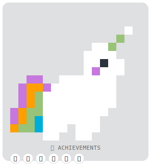

| Badge | Name | How to Unlock |
| :---: | :--- | :--- |
| 🌟 | First Commit | Make your first commit! |
| 💯 | Century | Reach 100 commits |
| 🚀 | Rocket | Reach 500 commits |
| 🔥 | On Fire | 7-day commit streak |
| ⚡ | Lightning | 30-day commit streak |
| 🌙 | Night Owl | Commit between midnight and 5 AM |
| 🌅 | Early Bird | Commit between 5-7 AM |
| 🎉 | Weekend Warrior | Commit on weekends |
| 📊 | Level 10/25/50/100 | Reach leveling milestones |

---

## 🎄 Seasonal Events (Auto-Detect!)

Your pet automatically wears holiday accessories based on the current date!

| 🎅 Christmas | 🎉 New Year | 💕 Valentine | 🎃 Halloween |
| :---: | :---: | :---: | :---: |
|  |  |  |  |

| 🧧 Lunar New Year | ☕ Programmer Day | 🌹 Women's Day | 🎩 Men's Day |
| :---: | :---: | :---: | :---: |
|  |  |  |  |

### 🥚 Easter Eggs & Special Events

| 👻 Friday 13th | 🤡 April Fools |
| :---: | :---: |
|  |  |

### 🌍 International Holidays (New!)

| ☘️ St Patrick's | 🌸 Nowruz | 🐰 Easter |
| :---: | :---: | :---: |
| 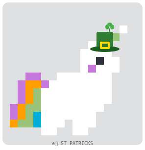 | 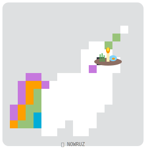 | 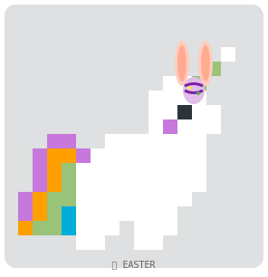 |

| 🥮 Mid-Autumn | 🪔 Diwali | 🦃 Thanksgiving |
| :---: | :---: | :---: |
|  |  | 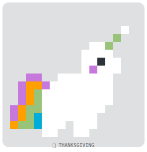 |

> **Holiday Dates:** Easter uses the Anonymous Gregorian Algorithm (works for any year!). Lunar holidays (Mid-Autumn, Diwali) use pre-calculated dates to ensure accuracy.

> **Priority Logic:** If a Major Holiday overlaps with a Special Event, the **Major Holiday** takes precedence.
> **Zero Config!** Accessories appear automatically - no setup needed!

---

## 🏆 Legendary Pets

Unlock special creatures by achieving milestones! **Harder achievements take priority.**

| 🦖 Mecha-Rex | 🐉 Hydra | 🗿 Cyber Golem | 👻 Void Spirit | 🦄 Unicorn |
| :---: | :---: | :---: | :---: | :---: |
|  |  |  |  |  |
| **1000+ commits** | **5+ languages** | **50+ closed issues** | **Night coder (00-04h)** | **⭐ Star/Fork this repo** |

---

## ✨ Mythical Pets (Ultra-Rare!)

The rarest tier! Unlock these legendary beings by achieving extraordinary feats.

| 🐲 Dragon | ⚡ Thunderbird | 🦊 Kitsune | 🌊 Leviathan | 🌟 Celestial |
| :---: | :---: | :---: | :---: | :---: |
| 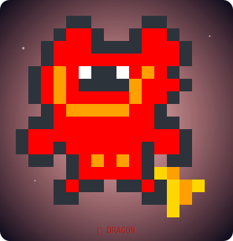 | 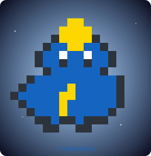 | 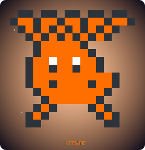 | 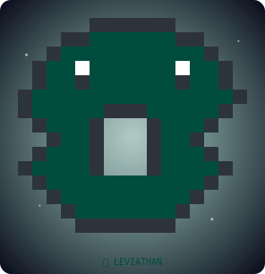 | 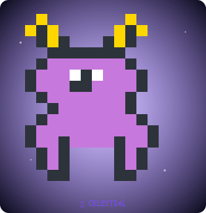 |
| **2000+ commits** | **100+ PRs merged** | **10+ active repos** | **50K+ lines of code** | **50+ stars received** |

> **Tier Priority:** Mythical > Legendary > Standard pets. Hardest achievements take precedence within each tier.

---

## 🦁 The Roster

| Pet | Preview |
| :--- | :---: |
| **Crab** (Rust) |  |
| **Elephant** (PHP) |  |
| **Coffee** (Java) |  |
| **Bird** (Swift) |  |
| **Robot** (C++/C#) |  |
| **Whale** (Docker) |  |
| **Gem** (Ruby) |  |
| **Chameleon** (HTML) |  |
| **Spider** (JS/TS) |  |
| **Snake** (Python) |  |
| **Gopher** (Go) |  |
| **Cat** (Default) |  |
| **Tux** (Shell) |  |
| **Fox** (Kotlin) |  |
| **Hummingbird** (Dart) |  |
| **Gear** (C) |  |
| **Ladder** (Scala) |  |
| **Owl** (R) |  |
| **Camel** (Perl) |  |
| **Capybara** (Lua) |  |
| **Alpaca** (Julia) |  |
| **Phoenix** (Elixir) |  |
