# 👾 Profile-Gotchi

[](https://github.com/features/actions)
[](https://opensource.org/licenses/MIT)
[](https://github.com/ThanhNguyxn/Git-Gotchi/releases/latest)

> **Turn your GitHub Profile into a living, breathing virtual pet habitat!** 🐾

## 🔴 Live Demo
This is the actual pet generated for **[ThanhNguyxn](https://github.com/ThanhNguyxn)**, updated daily at 00:00 UTC:

<div align="center">
  
</div>

**Profile-Gotchi** is a GitHub Action that generates a dynamic, pixel-art SVG of a virtual pet. Your pet's species and mood evolve based on your coding activity!

---

## ✨ Features

- **Dynamic Evolution**: Your pet changes species based on your top programming language.
- **Mood System**: Keep your pet happy by committing code daily!
- **Zero Config**: Works out of the box with sensible defaults.
- **Lightweight**: Generates a simple SVG, no heavy images.

---

## 🦁 The Pet Roster

Your coding habits determine your companion. [View the full Pet Gallery here](GALLERY.md).

| Language | Pet Species | Icon |
| :--- | :--- | :---: |
| **JavaScript / TypeScript** | **Spider** | 🕷️ |
| **Python** | **Snake** | 🐍 |
| **Go** | **Gopher** | 🐹 |
| **Rust** | **Crab** | 🦀 |
| **PHP** | **Elephant** | 🐘 |
| **Java** | **Coffee** | ☕ |
| **Swift** | **Bird** | 🕊️ |
| **C++ / C#** | **Robot** | 🤖 |
| **C** | **Gear** | ⚙️ |
| **Kotlin** | **Fox** | 🦊 |
| **Dart** | **Hummingbird** | 🐦 |
| **Scala** | **Ladder** | 🪜 |
| **R** | **Owl** | 🦉 |
| **Perl** | **Camel** | 🐪 |
| **Shell** | **Tux** | 🐧 |
| **Ruby** | **Gem** | 💎 |
| **HTML / CSS** | **Chameleon** | 🦎 |
| **Lua** | **Capybara** | 🦫 |
| **Julia** | **Alpaca** | 🦙 |
| **Elixir** | **Phoenix** | 🔥 |
| **Others** | **Cat** | 🐱 |
| **Star 🌟 or Fork 🍴** | **Unicorn** | 🦄 |

## 🎭 Moods & States

| State | Condition | Appearance |
| :--- | :--- | :---: |
| **Happy** ⚡ | Contributions in the last **24 hours** | Bouncing / Energetic |
| **Sleeping** 💤 | No contributions today, but active this week | Sleeping / Zzz |
| **Ghost** 👻 | No contributions for **7+ days** | Spooky / Dead |

---

## 📖 Setup Guide

Follow these steps to add a pet to your profile:

### Step 1: Create the Workflow File

1.  In your repository (e.g., `username/username`), go to the **Actions** tab.
2.  Click **New workflow** -> **set up a workflow yourself**.
3.  Name the file `profile-gotchi.yml`.
4.  Paste the following code:

```yaml
name: Profile Gotchi

on:
  schedule:
    - cron: '0 0 * * *' # Updates daily at 00:00 UTC
  workflow_dispatch: # Allows manual trigger

jobs:
  update-pet:
    permissions:
      contents: write
    runs-on: ubuntu-latest
    steps:
      - uses: actions/checkout@v3
      
      - name: Generate Pet 👾
        uses: ThanhNguyxn/Git-Gotchi@main
        with:
          github_token: ${{ secrets.GITHUB_TOKEN }}
          username: ${{ github.repository_owner }}
          
      - name: Commit & Push 💾
        run: |
          git config --global user.name 'github-actions[bot]'
          git config --global user.email 'github-actions[bot]@users.noreply.github.com'
          git add dist/pet.svg
          git commit -m "Update Profile-Gotchi 👾" || exit 0
          git push
```

### Step 2: Check Permissions

Ensure your workflow has permission to write to the repository:
1.  Go to **Settings** -> **Actions** -> **General**.
2.  Scroll down to **Workflow permissions**.
3.  Select **Read and write permissions**.
4.  Click **Save**.

### Step 3: Add the Pet to your Profile

Edit your `README.md` and add the following markdown where you want the pet to appear:

```markdown
### My Coding Pet 👾

```

---

## ⚙️ Configuration

| Input | Description | Required | Default |
| :--- | :--- | :---: | :---: |
| `github_token` | Your GitHub Token. Use `${{ secrets.GITHUB_TOKEN }}`. | ✅ | N/A |
| `username` | The GitHub username to track. | ✅ | N/A |

> [!NOTE]
> **Security Note**: The `${{ secrets.GITHUB_TOKEN }}` is a standard, temporary token automatically provided by GitHub Actions. It is **safe** to use in your workflow file and does **not** expose your personal access tokens or secrets.


---

## 🤝 Contributing

Contributions are welcome! Feel free to open an issue or submit a Pull Request.

1. Fork the project
2. Create your feature branch (`git checkout -b feature/AmazingFeature`)
3. Commit your changes (`git commit -m 'Add some AmazingFeature'`)
4. Push to the branch (`git push origin feature/AmazingFeature`)
5. Open a Pull Request

---

<p align="center">
  Made with ❤️ by <a href="https://github.com/ThanhNguyxn">ThanhNguyxn</a>
</p>
